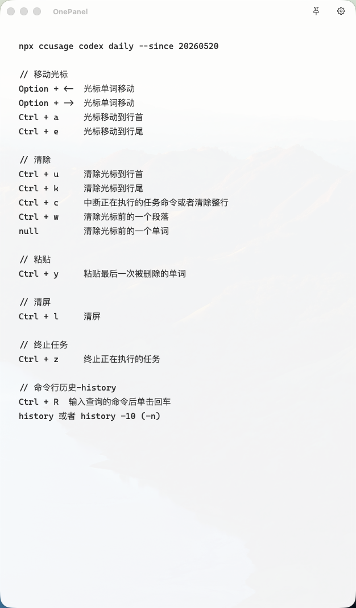
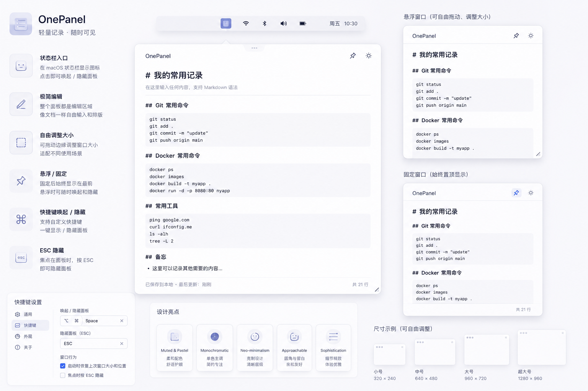

# OnePanel

OnePanel 是一个轻量、本地优先的 macOS 菜单栏工具，用来把一块纯文本工作面板始终放在手边。

它围绕“快速记录、快速查看、快速隐藏”这个场景设计：打开一个临时面板，写入或粘贴文本，用完立即收起，不需要管理完整的笔记应用。





## 适合什么场景

- 临时记录命令、片段、待办或备忘
- 在不同窗口之间快速查看一段纯文本内容
- 需要一个比完整笔记应用更轻、更快的输入面板
- 希望内容只保存在本机，不依赖云同步

## 功能特点

- 菜单栏应用，存在感轻
- 单一纯文本编辑面板，适合快速记录和查看
- 数据本地自动保存，不依赖云端
- 支持置顶与取消置顶
- 支持跨 Space 显示控制
- 支持按 `Esc` 快速隐藏
- 会记住窗口位置大小和置顶状态
- 支持自定义全局快捷键
- 提供独立设置窗口进行基础行为配置

## 系统要求

- macOS 14.0 及以上

## 下载与安装

你可以在 GitHub Releases 页面下载 `OnePanel.dmg`，打开后将 `OnePanel.app` 拖到 `Applications` 即可。

如果仓库已经启用了 Release 附件分发，DMG 会自动出现在对应版本的 Release assets 中。

## 首次打开提示“未知开发者”

当前分发的 `.dmg` 面向本地式分发，没有做 Developer ID 签名，也没有经过 notarization 公证。  
因此在别人的 Mac 上第一次打开时，系统可能会提示“来自未知开发者”。

如果遇到这个提示，可以这样操作：

1. 先把 `OnePanel.app` 拖到 `Applications`
2. 在 Finder 中尝试打开一次，然后关闭系统警告
3. 打开 `System Settings` -> `Privacy & Security`
4. 在页面靠下位置找到被拦截的应用提示，点击 `Open Anyway`
5. 在最终确认框中继续打开

另一个常见办法是：在 Finder 里对应用执行 `Control-click`，选择 `Open`，然后在弹窗中确认打开。

## 当前版本说明

OnePanel 目前是一个聚焦核心体验的 MVP，主要覆盖这条闭环：

1. 快速打开面板
2. 输入或粘贴纯文本
3. 立即隐藏
4. 下次回来时继续使用原内容

当前版本不包含同步、账号系统或富文本功能。

## 数据存储与隐私

OnePanel 是本地优先应用。文档和设置会保存在用户的 Application Support 目录中：

```text
~/Library/Application Support/OnePanel
```

当前项目不包含云同步、外部后端服务或账号系统。

## 开发说明

如果你是开发者，想参与构建、调试、测试或发布，请查看：

[docs/development.md](/Volumes/D/xbc/iOSProjects/OnePanel/docs/development.md)

## 许可证

本项目使用 MIT License。详见 [LICENSE](/Volumes/D/xbc/iOSProjects/OnePanel/LICENSE)。
